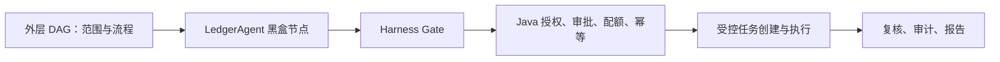

# 外层 DAG + LedgerAgent + Security Harness 实施待办

> 完成状态：2026-08-09 全部 Phase 1-8、测试清单、前端待办与 MVP 完成定义均已实现并验证通过。最终验证为 Java 426 tests / 0 failures / 0 errors / 4 skipped、Python 138 passed / 2 skipped、前端 build + vue-tsc + test:json-file + test:offline + test:visual 全部通过。实施详情见 PROGRESS_OUTER_DAG_LEDGER_2026-08-08.md 第五节。

> 生成日期：2026-08-07  
> 适用模块：`ai-runtime`、`security-toolbox-server`、`security-toolbox-web`  
> 目标：外层可视化 DAG 负责任务级编排，内部 LedgerAgent 负责受限 RAG/ReAct，Java Harness 负责唯一安全执行边界。  
> 不引入：Subagent、多智能体消息总线、GraphRAG、无限 ReAct、Python 直接执行扫描器。

## 1. 目标结构



LedgerAgent 内部保持当前已经实现的链路：

```text
route
  -> retrieval_guard
  -> retrieve
  -> assess
  -> rewrite（最多一次）
  -> grounded_generation
  -> grounded answer / typed action proposal
```

外层 DAG 不依赖内部 route、retrieve、assess、rewrite 等节点名称。LedgerAgent 对 UI 是一个节点，但其输入输出、Evidence 引用、action ID、策略版本、Ledger 事件和终态必须可验证。

## 2. 当前已完成

- [x] 默认使用项目级 `BM25Plus`，不再把 MockEmbedding 当作有效检索后端。
  - `ai-runtime/app/indexing.py:16, 121, 256-276, 415-500`
- [x] 检索前执行 project、target、conversation、TTL 可见性过滤。
- [x] 已有严格 `IntentDecision`、`EvidenceBundle`、`EvidenceDecision`、`GroundedPlannerOutput`。
  - `ai-runtime/app/schemas.py:166-379`
- [x] 已有 retrieval-first RAG 和最多一次 query rewrite。
  - `ai-runtime/app/graph.py:243-294, 342-730`
- [x] 已有检索轮次、LLM 调用数、Evidence 字符、超时和 recursion limit。
- [x] Runtime 协议已升级到 v2，包含 runId、stateVersion、policyRevision 和 Evidence provenance。
- [x] 前端已有可视化 Workflow V2 graph spec。
  - `security-toolbox-web/src/views/Workflow.vue:817-947`
- [x] Java 已校验 DAG 环路、孤立节点、节点/边数量和拓扑 group。
  - `security-toolbox-server/.../AgentWorkflowSpecService.java:121-289`
- [x] Java Runtime Client 已读取 `executableSteps()` 并向 Python 传递 workflow steps。
  - `security-toolbox-server/.../AiAgentRuntimeClient.java:392-429, 529-547`
- [x] 所有副作用任务统一进入 `SecurityAgentTools.executeAuthorizedPlan()`。
- [x] 当前测试已覆盖 RAG 路由、证据、一次改写、恶意 Evidence、协议和 Harness 零副作用。

## 3. 当前缺口

| 编号 | 缺口 | 当前代码表现 | 后果 | 优先级 |
|---|---|---|---|---|
| D-01 | Workflow 没有不可变运行版本 | `AgentWorkflowSpec` 是单例 JSON，主要只有 `updatedAt` | 无法证明一次 Turn 使用了哪份图 | P0 |
| D-02 | Workflow 全局单例 | `AgentWorkflowSpecService.SINGLETON_ID=1` | 多项目可能共享并覆盖同一工作流 | P0 |
| D-03 | Python 丢失 nodeId | Java 发送 `nodeId`，但 `WorkflowStep` 未声明且 `extra="ignore"` | Agent action 无法对应外层节点 | P0 |
| D-04 | LLM 主路径没有强制使用 workflow | `model.py:371-413` 的 grounded LLM Prompt 不含 workflow | 可视化 DAG 不能约束正常 LLM plan | P0 |
| D-05 | Java 最终计划丢失图字段 | `AiPlanResponse.PlanStep` 没有 nodeId/group/dependsOn | Harness 无法验证 DAG 闭包 | P0 |
| D-06 | group 不等于真实执行依赖 | `SecurityAgentTools.java:163-169` 直接创建全部任务 | 图中的先后关系可能只影响展示或 proposal 顺序 | P0 |
| D-07 | 没有持久化 Ledger | AgentState/SSE 是运行时状态，Java 只保存终态 provenance | 断流和重启后不能重建内部步骤 | P1 |
| D-08 | 事件缺少外层节点上下文 | 有 runId/stateVersion，但没有 outerNodeId/nodeRunId | UI、任务和审计无法归属 DAG 节点 | P1 |
| D-09 | Workflow Schema 较宽松 | `WorkflowStep.extra="ignore"`，parameters 为任意字典 | 未知字段和参数可能被静默忽略 | P0 |
| D-10 | 公开图与内部图混合 | graph API 同时返回公开阶段和 compiled internal graph | 黑盒边界不清晰 | P1 |
| D-11 | 没有 node 级恢复协议 | 请求没有 workflow digest、nodeRunId、resume token | 重试可能重新开始整轮 | P1 |
| D-12 | 外层条件终态没有统一语义 | 审批、拒绝、澄清、失败主要通过事件表达 | DAG 后继节点缺少统一跳过/暂停规则 | P1 |

## 4. 必须保持的安全不变量

- [x] 外层 DAG 是 tool node、顺序和依赖的唯一来源。
- [x] LLM 不能生成新节点、新边、新工具或修改 group。
- [x] LLM 只能返回 `workflowNodeId + typed parameter patch + evidenceRefs`。
- [x] tool、risk、requiresApproval、group 和 dependsOn 由 Java workflow snapshot 覆盖。
- [x] LedgerAgent 不能直接调用扫描器、TaskService、Shell 或数据库写工具。
- [x] 每个副作用 action 继续经过 Python defensive guard 和 Java Harness。
- [x] Evidence 只证明事实来源，不能扩大 workflow capability 或授权范围。
- [x] 外层 DAG 不允许循环；内部 ReAct 最多两轮检索。
- [x] Ledger 不记录 Chain-of-Thought，只保存有限结构化决策和执行事实。
- [x] workflowRevision、policyRevision、indexRevision、ledgerRevision 分别记录。
- [x] 任务已创建后，即使复核或审计失败，也必须保留真实 task IDs 和 executed 状态。

## 5. Phase 1：Workflow 作用域和不可变版本（P0）

- [x] 将 Workflow 从全局单例改为按 project/workspace 作用域存储。
- [x] 新增 `workflowId`、`scopeId`、`revision`、`specDigest`、`updatedBy`、`updatedAt`。
- [x] 服务端规范化 graph JSON 后计算 `sha256:<64 hex>`；不信任客户端 digest。
- [x] 每次保存生成新 revision，不原地覆盖运行中的 snapshot。
- [x] Agent Turn 启动时冻结 workflow snapshot，运行期间不读取新版本。
- [x] 默认模板先复制/绑定为不可变 snapshot 后再运行。
- [x] workflow 读取、保存和执行都要求当前项目访问权限。
- [x] 在 `turnId` 幂等摘要中加入 workflowDigest。

涉及文件：

- `security-toolbox-server/.../AgentWorkflowSpec.java`
- `security-toolbox-server/.../AgentWorkflowSpecRepository.java`
- `security-toolbox-server/.../AgentWorkflowSpecService.java`
- `security-toolbox-server/.../AiController.java`

验收标准：

- [x] 项目 A 保存 workflow 不影响项目 B。
- [x] 同一个 run 的所有事件使用相同 revision/digest。
- [x] 运行期间保存新版 workflow 不改变旧 run。

## 6. Phase 2：外层节点身份贯通（P0）

- [x] Python `WorkflowStep` 增加严格 `nodeId`，并改为 `extra="forbid"`。
- [x] WorkflowStep parameters 改用逐工具判别 Schema，不再使用任意字典。
- [x] Python `AgentRequest` 增加 `workflowId`、`workflowRevision`、`workflowDigest`、`outerNodeId`、`nodeRunId`。
- [x] Grounded action 增加必填 `workflowNodeId`。
- [x] Java `AiPlanResponse.PlanStep` 增加 `workflowNodeId`、`group`、`dependsOnNodeIds`。
- [x] `AiAgentRuntimeClient.toPlan()` 保留节点和依赖字段。
- [x] `AiTaskDispatchService.prepare()` 根据 Java snapshot 重新解析节点配置。
- [x] Action 引用不存在、已删除、工具不匹配的 nodeId 时整体拒绝。
- [x] workflowDigest 不一致时 fail-closed，不降级到当前最新图。

验收标准：

- [x] nodeId 从前端保存到 Java、Python plan、Java Harness、task audit 全程不丢失。
- [x] LLM 伪造 risk/group/approval 时，Java 仍使用 snapshot 配置。
- [x] 同一个 tool 的多个不同 node 可通过 nodeId 区分，并按服务端规则判断是否允许。

## 7. Phase 3：让 LLM 主路径服从外层 DAG（P0）

当前 local fallback 会使用 workflow，但 grounded LLM 主路径尚未强制绑定，应完成：

- [x] 将 workflow capability manifest 注入 Grounded Planner Prompt。
- [x] Manifest 只包含 nodeId、tool、允许参数 Schema、依赖和服务端摘要，不包含可执行代码。
- [x] LLM 只能从 manifest 中选择 nodeId，不能输出 graph 或 edges。
- [x] 生成后调用 `validate_workflow_action_closure()` 校验所有 action。
- [x] Java 再次执行同样的闭包校验，Python 结果不能作为最终事实源。
- [x] GENERAL_QA/PROJECT_QA 不触发外层 tool nodes。
- [x] ACTION_PLAN 只能选择当前 snapshot 允许的节点。
- [x] `retrieve_project_context` 保留为 LedgerAgent 内部只读能力，不混入最终副作用 DAG。
- [x] 规则 Planner 降级也使用同一 manifest 和同一闭包校验。

涉及文件：

- `ai-runtime/app/model.py:371-413`
- `ai-runtime/app/schemas.py`
- `ai-runtime/app/graph.py`
- `security-toolbox-server/.../AiAgentRuntimeClient.java`

## 8. Phase 4：明确 DAG 执行语义（P0）

- [x] 明确同一拓扑层是否允许并行；默认仅允许独立、低风险节点并行。
- [x] 后继节点只有在所有前置节点 COMPLETED 后才可创建或启动。
- [x] 前置节点 DENIED、FAILED、APPROVAL_REQUIRED 时，后继子图默认 SKIPPED/PAUSED。
- [x] approval gate 暂停后继子图，审批恢复时重新校验授权和 workflow digest。
- [x] 每个 nodeRun 生成独立幂等键。
- [x] 已完成节点不得因其他节点失败而重复执行。
- [x] Java 任务模型增加 workflowNodeId、nodeRunId 和依赖 task IDs，或增加独立 NodeRun 表。
- [x] after-commit 调度器只能启动依赖已满足的任务。
- [x] 若本轮不实现 task 依赖调度，必须把 DAG 定义为“计划顺序图”，不得宣称它控制真实任务执行顺序。

涉及文件：

- `security-toolbox-server/.../AiPlanResponse.java`
- `security-toolbox-server/.../SecurityAgentTools.java:139-188`
- `security-toolbox-server/.../TaskService.java`
- `security-toolbox-server/.../TaskProgressEventService.java`

## 9. Phase 5：LedgerAgent Facade（P0）

- [x] 不创建新的多 Agent 框架；将现有 `SecurityAgentRuntime` 定义/包装为 LedgerAgentRuntime。
- [x] 提供唯一输入 `LedgerAgentContext` 和唯一输出 `LedgerAgentResult`。
- [x] Context 包含 project、target、conversation、turn、workflow digest、outerNodeId、policy revision 和 budget。
- [x] Result 只包含 status、answer、evidenceIds、typed actions、terminationReason 和 ledgerDigest。
- [x] LedgerAgent 内部继续使用当前 RAG/ReAct，不允许调用外部副作用工具。
- [x] LedgerAgent 不能返回授权结论，只能返回 action proposal。
- [x] 输出未知 Evidence、未知 node、跨 scope ID 或错误 digest 时整体拒绝。

建议输入：

```json
{
  "workflowDigest": "sha256:...",
  "outerNodeId": "ledger-agent-01",
  "nodeRunId": "node-run-01",
  "projectId": 12,
  "targetId": 3,
  "conversationId": "session-a",
  "turnId": "turn-001",
  "policyRevision": "java-authoritative-v1",
  "budget": {
    "maxRetrievalRounds": 2,
    "maxLlmCalls": 4,
    "timeoutSeconds": 30
  }
}
```

建议输出：

```json
{
  "status": "COMPLETED",
  "intent": "ACTION_PLAN",
  "evidenceIds": ["ev-finding-1024"],
  "proposedActions": [
    {
      "workflowNodeId": "ports-01",
      "parameters": {"ports": "80,443"},
      "evidenceRefs": ["ev-finding-1024"]
    }
  ],
  "ledgerDigest": "sha256:...",
  "terminationReason": "EVIDENCE_SUFFICIENT"
}
```

## 10. Phase 6：持久化 Ledger（P1）

建议 Ledger Entry 字段：

```text
ledgerId
runId
workflowId
workflowRevision
workflowDigest
outerNodeId
nodeRunId
sequence
innerStep
eventType
status
inputDigest
outputDigest
evidenceIds
actionIds
policyRevision
indexRevision
previousEntryDigest
entryDigest
createdAt
```

- [x] 在 Java 新增 `AgentLedgerRecord`、Repository 和 Service。
- [x] Java 在 Runtime v2 事件通过协议校验后写入 Ledger。
- [x] `(runId,nodeRunId,sequence)` 建唯一约束，重复事件幂等。
- [x] sequence 严格递增，不能跳号或倒退。
- [x] `entryDigest` 使用 canonical JSON 计算。
- [x] `previousEntryDigest` 组成 append-only hash chain。
- [x] 终态后禁止追加普通步骤，只允许独立审计修正记录。
- [x] 不记录完整 Prompt、Evidence 正文、token、HMAC、原始 Chain-of-Thought。
- [x] 终态至少支持 COMPLETED、CLARIFY、DENIED、APPROVAL_REQUIRED、FAILED。
- [x] Java 是 Ledger 权威持久化端；Python 内存 State 不能作为唯一 Ledger。

## 11. Phase 7：事件与公开黑盒边界（P1）

- [x] public graph API 默认只返回外层 DAG。
- [x] compiled internal LangGraph 放入管理员 debug 接口或受保护开关。
- [x] public node 使用 `outerNodeId`，内部步骤使用 `innerStep`。
- [x] v3 事件增加 workflowDigest、outerNodeId、nodeRunId、ledgerSequence、ledgerEntryDigest。
- [x] Python、Java Client、Orchestrator、前端类型和 E2E 同步升级 contractVersion。
- [x] workflowDigest 不一致、unknown outerNodeId、ledger sequence 跳跃时 fail-closed。
- [x] 前端只展示公开状态、证据数量、action 数量、task IDs 和终止原因。
- [x] 前端不展示系统 Prompt、完整 Evidence 或思维链。

建议事件公共字段：

```json
{
  "contractVersion": 3,
  "runId": "run-01",
  "workflowDigest": "sha256:...",
  "outerNodeId": "ledger-agent-01",
  "nodeRunId": "node-run-01",
  "innerStep": "rewrite",
  "stateVersion": 12,
  "ledgerSequence": 5,
  "ledgerEntryDigest": "sha256:...",
  "policyRevision": "java-authoritative-v1"
}
```

## 12. Phase 8：恢复和幂等（P1）

- [x] 以 runId + nodeRunId 查询当前 Ledger 状态。
- [x] 只恢复最后一个未终止的 outer node，不恢复未验证的任意 Python State。
- [x] 恢复前重新验证 project、target、workflow digest、policy revision 和时间窗。
- [x] 已完成节点不重复执行；只允许失败节点按策略重试。
- [x] APPROVAL_REQUIRED 恢复必须重新读取审批，不复用旧布尔值。
- [x] workflow digest 变化后旧 run 结束为 STALE_WORKFLOW，不能继续执行。
- [x] Runtime 断流后根据 Ledger 判断是否已创建任务，不盲目创建新 Turn。
- [x] task 创建成功、Reviewer 失败时保留真实 task IDs 和 executed=true。

## 13. 测试清单

### 13.1 Workflow/DAG

- [x] Workflow 按项目隔离。
- [x] 服务端 revision/digest 稳定且不可伪造。
- [x] 环、孤立节点、未知 tool、重复 node ID 整体拒绝。
- [x] 运行中的 snapshot 不受新版本影响。
- [x] nodeId/group/dependsOn 在 Java -> Python -> Java 往返中不丢失。
- [x] 模型伪造 risk/approval/group 不影响服务端配置。
- [x] public graph 不泄露内部 LedgerAgent 节点。

### 13.2 Ledger

- [x] Ledger sequence 严格递增。
- [x] hash chain 篡改可检测。
- [x] 重复事件幂等。
- [x] finish 后追加步骤被拒绝。
- [x] workflowDigest、runId、policyRevision 不一致时拒绝。
- [x] Ledger 中不出现完整 Prompt、Chain-of-Thought、凭据或 Evidence 正文。

### 13.3 LedgerAgent

- [x] GENERAL_QA 不启动 tool node。
- [x] PROJECT_QA 使用当前 EvidenceBundle 生成 grounded answer。
- [x] 一次 rewrite 只发生一次第二轮检索。
- [x] Agent 不能增加节点、边或 workflow 外工具。
- [x] Evidence 提示注入不能修改 workflow capability。
- [x] Typed action 必须同时引用合法 workflow node 和 Evidence。

### 13.4 Java-Python-Harness E2E

- [x] 保存 DAG -> 冻结 snapshot -> LedgerAgent -> Harness -> task/audit 完整通过。
- [x] 未知 node/tool 时零任务、零派发。
- [x] 前置节点失败时后继节点不启动。
- [x] 同一 nodeRun 重试不重复已完成任务。
- [x] workflow 修改、授权撤销、审批撤回后重新校验。
- [x] 断流恢复不重复任务且 Ledger hash chain 连续。
- [x] Java Planner fallback 也生成相同外层 Ledger 字段。

## 14. 前端待办（P1）

- [x] 保存并显示服务端返回的 workflowId/revision/digest。
- [x] Agent run 明确选择 workflow snapshot。
- [x] LedgerAgent 显示为不可拆分的系统节点。
- [x] 节点运行状态显示 ROUTING、RETRIEVING、GROUNDED、WAITING_APPROVAL、EXECUTING、REVIEWED、FAILED。
- [x] Evidence 只展示 ID、标题、来源和摘要长度。
- [x] 失败节点展示 nodeRunId、terminationReason 和是否可恢复。
- [x] 不提供无条件“重新执行全部”；按 nodeRun 状态决定可用操作。
- [x] workflow digest 变化时要求重新确认，不静默覆盖旧运行。

## 15. 实施顺序

| 顺序 | 工作包 | 优先级 | 交付结果 |
|---:|---|---|---|
| 1 | Workflow 项目作用域、revision、digest | P0 | 外层图成为不可变快照 |
| 2 | nodeId/group/dependsOn 严格往返 | P0 | 节点身份不丢失 |
| 3 | LLM 主路径强制使用 workflow manifest | P0 | Agent 不能越过外层图 |
| 4 | Java Harness 验证 workflow action 闭包 | P0 | 外层图成为安全事实源 |
| 5 | 明确并实现任务依赖语义 | P0 | 图顺序与实际执行一致 |
| 6 | LedgerAgent Facade | P0 | 内部实现形成稳定黑盒契约 |
| 7 | Java 权威 Ledger 持久化 | P1 | 可审计、可恢复 |
| 8 | v3 外层/内层事件协议 | P1 | UI、Ledger、任务可关联 |
| 9 | 恢复、篡改和跨项目测试 | P1 | 状态不重复、不越权 |
| 10 | 前端黑盒节点与状态展示 | P1 | 可视化与内部实现解耦 |

## 16. MVP 完成定义

- [x] Workflow 按项目保存并生成 revision/digest。
- [x] 每次运行冻结 snapshot，并将 digest 写入请求和审计。
- [x] Python WorkflowStep 和 Java PlanStep 全程保留 nodeId。
- [x] LLM grounded plan 只能引用当前 workflow node。
- [x] Java 覆盖 tool、risk、approval、group 和依赖，不信任模型字段。
- [x] RAG/ReAct 作为 LedgerAgent 黑盒，最多一次查询改写。
- [x] Ledger 持久化外层节点开始、完成、拒绝、失败和 task IDs。
- [x] public DAG 与内部 LangGraph 分离展示。
- [x] E2E 证明“外层 DAG -> LedgerAgent -> Harness -> Audit”。
- [x] 若未实现任务依赖调度，文档明确 DAG 仅表示计划顺序。

## 17. 停止线

- [x] 不允许 LLM 生成新的 DAG 节点或边。
- [x] 不让 LedgerAgent 直接执行工具。
- [x] 不新增 Subagent、代理身份或代理间授权。
- [x] 不实现任意表达式、动态代码、任意 SQL/Cypher。
- [x] 不把 Prompt、Chain-of-Thought 或敏感 Evidence 正文写入 Ledger。
- [x] 不同时加入 GraphRAG、图数据库和同轮扫描反馈。

论文表述建议：

> 本系统采用外层可视化 DAG 进行任务级、可审计的流程编排；在 LedgerAgent 黑盒节点内部执行受限的证据检索与 ReAct 决策；所有副作用动作必须经过 Java Security Harness 的最终授权和事务执行。
