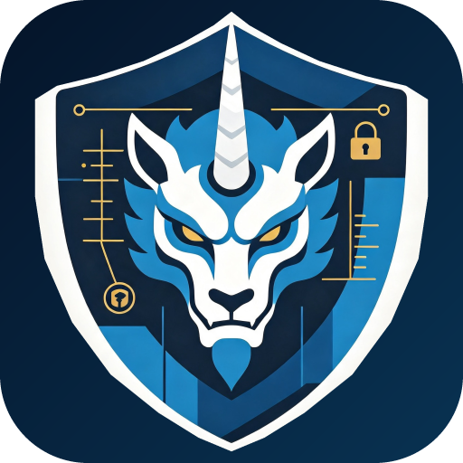

# 獬豸（Xiezhi）授权安全测试平台

<p align="center"></p>

獬豸是一种象征辨是非、守边界的中国神兽，契合本项目“先确认授权边界，再执行受控安全测试”的设计原则，英文名称为 **Xiezhi**。

系统采用 Electron、Vue 3 与 Spring Boot 的桌面化前后端分离架构，面向自建靶场、局域网资产和已书面授权目标，覆盖“安全评估项目—授权目标—信息收集—受控任务—漏洞复测—项目报告”的完整业务链。

## Windows 桌面版

桌面版采用 Electron 承载 Vue 3 工作区，并由桌面主进程自动启动和关闭 Spring Boot 本地引擎。从源码运行前需要安装 Java 17、Maven 和 Node.js。首次拉取项目后先安装前端依赖，再启动桌面开发模式：

```powershell
npm --prefix .\security-toolbox-web ci
powershell -ExecutionPolicy Bypass -File scripts\start-desktop.ps1
```

启动后会先显示运行环境检查，再进入首次依赖检测页面。关闭桌面窗口时，本地 Java 后端会同步退出，不需要单独关闭服务。桌面版只监听 `127.0.0.1`，每次启动会在 `18080-18120` 范围选择空闲端口。

桌面版的本地数据库和日志不写入安装目录，而是保存在当前 Windows 用户的应用数据目录：

- 数据库：`%APPDATA%\security-toolbox-desktop\data`
- 日志：`%APPDATA%\security-toolbox-desktop\logs`

为兼容已有安装的数据和登录状态，应用数据目录、数据库文件名及部分构建文件仍沿用 `security-toolbox` 标识。这些兼容名称不影响界面和发布版本使用“獬豸 / Xiezhi”品牌。

运行桌面版需要系统提供 Java 17 x64。

首次依赖检查支持安装 Nuclei、httpx、Afrog、Xray，以及 Nuclei 模板和 Afrog/Xray PoC 目录。应用从各项目的官方发布源获取文件，对提供官方校验清单的发布包核对 SHA-256，并为安装结果保存来源与摘要信息。工具目录可由用户选择，应用会检查目录边界和写入权限。

Java、Npcap、Nmap、PostgreSQL 等需要运行时、驱动或系统安装的依赖只提供官方安装入口，不会静默运行安装程序。若应用位于不可写的系统目录，仍可正常启动，但便携工具安装会提示目录权限不足。

## 构建环境与本地打包

完整构建 Windows 桌面版需要以下环境：

- Windows 10/11 x64。
- PowerShell 5.1 或更高版本，推荐 PowerShell 7。
- JDK 17 x64 和 Maven，推荐 Maven 3.9 或更高版本。
- Node.js 24.x 和随附的 npm。
- CPython 3.11 或更高版本 x64。AI Runtime 使用了 Python 3.11+ API，构建脚本会拒绝过旧版本、非 CPython 或 32 位解释器。

Electron、Electron Builder、PyInstaller 和 NSIS 不需要全局安装，分别由 npm、pip 和 Electron Builder 管理。首次构建前可检查环境：

```powershell
java -version
mvn -version
node --version
npm --version
python -c "import struct,sys; print(sys.executable); print(sys.implementation.name); print('.'.join(map(str,sys.version_info[:2]))); print(str(struct.calcsize('P')*8) + '-bit')"
```

Python 检查结果必须为 CPython 3.11+ 和 64-bit。使用 Conda 或 Virtualenv 时，可以先激活对应环境，再安装构建依赖：

```powershell
python -m pip install --upgrade pip
python -m pip install -r .\ai-runtime\requirements-build.txt

Push-Location .\security-toolbox-web
npm ci --include=dev
Pop-Location
```

生成经过测试和健康检查的 AI Runtime、Spring Boot JAR、Electron 解包目录、便携版 ZIP 和校验文件：

```powershell
powershell -NoProfile -ExecutionPolicy Bypass -File .\scripts\package-desktop-release.ps1
```

脚本优先使用 `ai-runtime\.venv`；否则会检查当前激活的 Virtualenv/Conda 环境、`PATH`、Windows Python Launcher 和本机已有的 Conda 环境，并自动选择最接近最低要求的兼容版本。例如同时安装 3.11 和 3.14 时会选择 3.11。需要明确指定解释器时，可以执行：

```powershell
$pythonForBuild = if ($env:CONDA_PREFIX) {
  Join-Path $env:CONDA_PREFIX 'python.exe'
} else {
  (Get-Command python.exe).Source
}
powershell -NoProfile -ExecutionPolicy Bypass `
  -File .\scripts\package-desktop-release.ps1 `
  -Python $pythonForBuild
```

在 Anaconda Prompt 或 `cmd.exe` 中，可以直接传入当前 Conda 环境：

```bat
powershell -NoProfile -ExecutionPolicy Bypass -File .\scripts\package-desktop-release.ps1 -Python "%CONDA_PREFIX%\python.exe"
```

当前 Electron npm 包不会在 `npm ci` 后自动创建 `node_modules\electron\dist`；这是正常行为。打包时 Electron Builder 会按项目版本从本机缓存或官方源取得运行时，不需要手动创建该目录。

便携版输出位于：

```text
security-toolbox-web\desktop-release\xiezhi-<version>-portable.zip
security-toolbox-web\desktop-release\win-unpacked\
security-toolbox-web\desktop-release\SHA256SUMS.txt
```

可直接运行 `security-toolbox-web\desktop-release\win-unpacked\獬豸安全测试平台.exe`。源码中的界面修改不会自动进入旧 EXE；更新前端内容后，需要重新执行打包命令、完全退出旧程序，再启动新生成的 EXE。

如需在本机继续生成未签名的 NSIS 安装包，先完成上述组件构建，再执行：

```powershell
Push-Location .\security-toolbox-web
$env:CSC_IDENTITY_AUTO_DISCOVERY='false'
npm exec -- electron-builder --win nsis `
  "--config.directories.output=desktop-release/installer"
Remove-Item Env:CSC_IDENTITY_AUTO_DISCOVERY -ErrorAction SilentlyContinue
Pop-Location
```

安装包输出为 `security-toolbox-web\desktop-release\installer\xiezhi-<version>-setup.exe`。构建产物、依赖目录、虚拟环境和缓存均已由 `.gitignore` 排除，不会纳入版本控制。

## GitHub Actions

仓库包含两条 GitHub Actions 工作流：

- `.github/workflows/ci.yml`：在 `main`/`master` 提交、Pull Request 或手动触发时，以只读权限检查仓库卫生，并行运行 Spring Boot 测试、AI Runtime 测试、前端/Electron 边界测试和 Vue 生产构建。
- `.github/workflows/release-windows.yml`：在推送版本标签或手动选择已有标签时，使用 Java 17、Python 3.11 和 Node.js 24 构建 Windows 便携版 ZIP 与未签名 NSIS 安装包。

发布标签必须与 `security-toolbox-web/package.json` 中的版本严格一致：

```powershell
$version = (Get-Content .\security-toolbox-web\package.json -Raw | ConvertFrom-Json).version
git tag "v$version"
git push origin "v$version"
```

推送标签会自动创建或更新 GitHub Release。也可以在 Actions 页面手动运行 `Windows Desktop Release`：填写一个已经存在的标签，`publish=false` 时只生成 Actions Artifact，设为 `true` 时同时发布 Release。

发布资产包含 `xiezhi-<version>-portable.zip`、`xiezhi-<version>-setup.exe` 和对应的 `SHA256SUMS.txt`。当前安装包未进行代码签名，终端用户仍需安装 Java 17。

## 仓库结构

项目采用单仓库结构，前端、后端、AI Runtime、Electron 桌面端和自动化工作流按同一版本协同构建：

- `.github/`：持续集成与 Windows 发布工作流。
- `ai-runtime/`：Python AI Runtime 源码及打包配置。
- `security-toolbox-server/`：Spring Boot 本地引擎。
- `security-toolbox-web/`：Vue 3 前端与 Electron 桌面端。
- `scripts/`：启动、停止、状态检查和发布脚本。

依赖目录、构建产物、运行数据、数据库、证书、日志、缓存和本地密钥均由 `.gitignore` 排除；CI 还会检查仓库范围，避免将本地运行文件误加入提交。

## 浏览器开发模式

在项目根目录双击 `start-all.cmd`，或执行：

```powershell
powershell -ExecutionPolicy Bypass -File scripts\start-all.ps1
```

后端冷启动默认等待最多 90 秒；较慢的开发环境可通过
`-BackendStartupTimeoutSeconds` 调整，例如等待 180 秒：

```powershell
powershell -ExecutionPolicy Bypass -File scripts\start-all.ps1 -BackendStartupTimeoutSeconds 180
```

脚本会同时启动 Spring Boot 后端和 Vue 3 前端，等待 8080、5173 端口就绪后自动打开浏览器。

首次启动时，脚本会生成随机管理员口令、JWT 密钥和 HTTPS MITM CA 口令，并使用当前 Windows 用户的 DPAPI 加密保存到 `.run/development-secrets.json`；该文件仅允许当前用户访问。

同时关闭前后端可双击 `stop-all.cmd`，或执行：

```powershell
powershell -ExecutionPolicy Bypass -File scripts\stop-all.ps1
```

查看运行状态：

```powershell
powershell -ExecutionPolicy Bypass -File scripts\status-all.ps1
```

## 技术栈

- 后端：Java 17、Spring Boot 3.5.16、Spring Security、Spring Data JPA、H2/PostgreSQL、Bouncy Castle、Netty HTTP/2、OpenPDF
- 前端：Vue 3、TypeScript、Vite、Element Plus、Pinia、Vue Router、Axios、ECharts
- 桌面端：Electron、Windows Mica/Acrylic 外观、受限 IPC、本地 Java 服务生命周期与便携工具管理
- AI：Python FastAPI 本地运行时、LangChain、LangGraph、关键词或真实向量项目检索与 Java 受控执行层，兼容 OpenAI Chat Completions、Responses API、Embedding API 及 CC Switch（CCS）本地代理

## AI Agent 架构

本项目采用轻量级的项目资料检索与受控执行架构。项目事实问题和行动请求必须先经过项目级检索；检索方式可选本地关键词匹配或真实向量相似度，并且都会保留可核对的证据标识、摘要和索引版本。证据不足时最多允许一次只读查询改写。Python 只生成结构化提案，所有会产生实际影响的任务仍由 Java 根据数据库实时状态重新校验后创建。

该实现不属于 GraphRAG 或多智能体系统：没有图数据库、实体关系遍历、Subagent 身份、代理间消息或无限自主循环。当前进度、已完成能力、剩余缺口和验证限制见 [PROJECT_PROGRESS.md](PROJECT_PROGRESS.md)；前后端逐文件业务源码说明见 [BUSINESS_SOURCE_ANALYSIS.md](BUSINESS_SOURCE_ANALYSIS.md)。

## 主要功能

1. JWT 登录鉴权、BCrypt 密码存储、角色限制和默认管理员初始化。
2. 安全评估项目管理：授权声明、负责人、有效期、状态和项目目标关联。
3. 授权目标登记、端口范围、单目标有效期与启停管理；列表和编辑界面显示目标独立授权时间，未单独设置时明确继承项目授权窗口；任务创建时同时校验项目和目标授权。
4. 被动/受控信息收集、HTTP 指纹识别、框架识别、WAF 判断和证据留存。
5. AI 或本地规则先检索项目证据，再生成可引用 Evidence ID 的回答或受控检测计划，支持一次查询改写、连续对话、NDJSON 实时 Plan 和结果总结。
6. 白名单工具注册、异步任务、取消/失败重试、SSE 进度事件、实际命令日志和并发控制。
7. TCP 探测、Nmap 服务识别、HTTP 响应头与安全项检查、TLS 配置检查，以及受限的 Nuclei、Afrog、Xray 扫描。
8. 任务创建时固化授权、端口、工具版本、规则版本和所选模板/PoC 摘要，执行前再次比对快照。
9. 漏洞知识库、CVE/CWE/CVSS/EPSS/CISA KEV 元数据、主动检测、扫描后路径、复测和扫描 Diff。
10. HTTP/HTTPS MITM、HTTP/2 抓包、黑白名单过滤、标记/删除、AI 分析与对话、受控报文重放和独立抓包浏览器。
11. 任务 HTML、目标聚合 PDF、项目结构化摘要、审计日志、项目审批、定时扫描和受控安全动作数据模型。
12. 离线编码、哈希、AES、网络计算、HTTP/IOC/端点/文件分析、文件十六进制/ASCII 分块查看、JWT/JSON/时间戳和随机生成工具。
13. 默认禁止公网目标、任意 Shell、密码爆破、横向移动和破坏性自动利用。

## 安全评估项目与信息收集

安全评估项目统一管理授权声明、负责人、有效期和目标范围。只有项目与目标均处于有效授权状态时才能创建任务；任务会保存授权、端口、工具和规则快照，避免配置变化后继续按旧范围执行。

项目工作区集中提供目标关联、探测、信息收集、检测任务、漏洞复测、审批审计和报告。信息收集覆盖 DNS、TLS、HTTP、证书透明度、RDAP 等来源；不可用的数据源会明确标记，不会生成伪造结果。主动探测始终要求有效授权和用户确认。

## CCS 本地代理适配

桌面版可以把 CC Switch（CCS）作为本地 OpenAI 兼容代理使用。獬豸不会读取 Codex 或 Claude Code 的配置文件，也不会启动这些命令行程序；它只向用户配置的 CCS HTTP 地址发送请求。

在“系统设置 → AI 模型服务”中启用 CCS 本地代理后，填写 CCS 的根地址或以 `/v1` 结尾的地址，并填写 CCS 中实际配置的路由模型。不要填写完整的 `/v1/responses` 路径，应用会自行拼接接口地址。CCS 模式使用 OpenAI Responses API，具体供应商、账号和上游凭据由 CCS 管理。

如果不使用 CCS，也可以直接配置其他 OpenAI 兼容 API 地址、API Key 和模型。

## AI 对话与向量检索配置

桌面应用可在“系统设置 -> AI 模型服务”中选择知识检索方式。使用“BM25 关键词”时完全在本地检索，不调用向量服务；使用“真实向量嵌入”时有两种连接方式：

- **复用对话连接**：向量请求使用对话模型的 API 地址和 API Key，但仍需单独填写该服务实际支持的 Embedding 模型名称。所用兼容服务必须提供 `/embeddings` 接口。
- **单独配置**：向量服务使用自己的 API 地址、API Key 和 Embedding 模型，可以与对话服务来自不同供应商。服务不要求鉴权时，向量 API Key 可以留空。

两类密钥均由桌面主进程使用 Windows 安全存储加密，保存配置会重启本地服务。修改 API 地址时，应用会要求重新填写与新地址对应的密钥，避免把旧密钥误发给新服务。

非桌面部署可直接配置 Python Runtime。以下是完整的真实向量相关环境变量：

```powershell
$env:AI_RUNTIME_RETRIEVAL_BACKEND='real_embedding'
$env:AI_RUNTIME_EMBEDDING_BASE_URL='https://api.openai.com/v1'
$env:AI_RUNTIME_EMBEDDING_API_KEY='your-embedding-api-key'
$env:AI_RUNTIME_EMBEDDING_MODEL='text-embedding-3-small'
$env:AI_RUNTIME_EMBEDDING_DIMENSION='0'            # 0 表示从首次响应推断
$env:AI_RUNTIME_EMBEDDING_TIMEOUT_SECONDS='15'
$env:AI_RUNTIME_EMBEDDING_BATCH_SIZE='16'
$env:AI_RUNTIME_EMBEDDING_MAX_INPUT_CHARS='12000'
```

如需复用对话服务的密钥，可以不设置 `AI_RUNTIME_EMBEDDING_API_KEY`，Runtime 会读取 `AI_RUNTIME_API_KEY`；地址不会隐式复用，应把 `AI_RUNTIME_EMBEDDING_BASE_URL` 明确设为同一个兼容 API 地址。真实向量服务不可用或返回无效向量时会停止本次索引/检索，不会悄悄改用关键词结果。

非桌面模式可以通过环境变量接入 CCS：

```powershell
$env:AI_ENABLED='true'
$env:AI_BASE_URL='http://127.0.0.1:15721'
$env:AI_API_MODE='responses'
$env:AI_MODEL='model-name-configured-in-ccs'
$env:AI_API_KEY='' # CCS 不要求访问令牌时可以留空
mvn -f .\security-toolbox-server\pom.xml spring-boot:run
```

## 漏洞库与主动检测

系统将漏洞知识与可执行规则分开管理。知识库保存风险、检测思路、修复建议和公开漏洞元数据；可执行规则只能绑定后端白名单中的受控工具。

Nuclei 模板从 ProjectDiscovery 官方稳定版本同步并校验 checksums；Afrog 与 Xray 使用各自官方发布及 PoC 目录。三个目录会并行检查本地版本、展示下载和导入进度，并在切换页面后继续同步。默认扫描只允许经过审核的低风险模板/PoC，排除侵入式利用、RCE、注入、OAST、反连和爆破等高影响行为；应用不会下载执行任意脚本，也不会让 AI 生成可执行 PoC。

主动检测页默认选择当前目标兼容的安全规则，按 Nuclei、Afrog、Xray 分别创建受控扫描任务。每个任务只执行用户选择且文件摘要核验通过的模板/PoC，解析结果后还会再次核对目标主机和端口，再统一生成漏洞记录。

定时扫描可以选择 Nuclei、Afrog 或 Xray，并明确指定 1–50 个已核验的 `SAFE` PoC；无人值守派发不会接受需审查或高影响 PoC，每次派发和实际执行前都会重新校验授权、SAFE 分级、本地文件路径与 SHA-256。指纹规则库在项目详情中由管理员导入本地 JSON，服务端校验版本、规则数量和摘要后原子替换，更新失败保留旧版本；当前指纹库更新不是自动联网更新。

## 扫描后的 AI 路径与安全自动化

漏洞结果可以生成基于证据的后续验证路径，展示假设、前置条件、限制和停止条件。用户审核后，低风险 `SAFE` 步骤可以创建受控任务；`CAUTION` 步骤只提供人工审查建议。

执行前会重新验证目标授权、端口范围、漏洞状态和工具白名单。AI 只能解释和排序服务端允许的步骤，不能提交 Shell 命令、修改工具参数或自动执行利用代码。

## 流量分析与 AI 建议

流量工作台可以为已授权目标启动仅监听本机的 HTTP/HTTPS 代理，并提供会话筛选、标记、原始报文查看、AI 分析和受控重放。HTTPS 分析需要用户显式启用本地 MITM 并信任应用生成的 CA。

请求与响应在保存或提交给 AI 前会进行长度限制和敏感字段脱敏。重放操作会重新校验目标、URL、端口、方法和请求头，防止请求离开授权范围。

## 启动后端

直接使用 Maven 启动不会代管开发凭据。启动前必须同时提供强管理员口令、至少 32 字节的 JWT 密钥和强 CA 口令：

```powershell
$env:ADMIN_PASSWORD='replace-with-a-strong-local-password'
$env:JWT_SECRET='replace-with-at-least-32-random-bytes'
$env:TRAFFIC_MITM_CA_PASSWORD='replace-with-a-strong-local-ca-password'
mvn -f .\security-toolbox-server\pom.xml spring-boot:run
```

默认使用本地 H2 文件数据库，接口地址为 `http://localhost:8080/api`。

如需真实调用兼容 OpenAI 的 API，先配置环境变量：

```powershell
$env:AI_ENABLED='true'
$env:AI_BASE_URL='https://api.openai.com'
$env:AI_API_KEY='your-api-key'
$env:AI_MODEL='gpt-4.1-mini'
mvn -f .\security-toolbox-server\pom.xml spring-boot:run
```

未配置密钥时，系统自动使用本地规则规划器，仍可完整演示“生成计划—人工审核—执行工具—记录结果”的流程。

## 启动前端

```powershell
cd security-toolbox-web
npm ci
npm run dev
```

浏览器访问 `http://localhost:5173`。Vite 已将 `/api` 代理到 Spring Boot 的 8080 端口。

## PostgreSQL 模式

```powershell
$env:POSTGRES_PASSWORD='replace-with-a-strong-local-database-password'
docker compose up -d postgres
$env:SPRING_PROFILES_ACTIVE='postgres'
$env:DB_URL='jdbc:postgresql://localhost:5432/security_toolbox'
$env:DB_USERNAME='postgres'
$env:DB_PASSWORD=$env:POSTGRES_PASSWORD
mvn -f .\security-toolbox-server\pom.xml spring-boot:run
```

安装 Docker 后，可用 `docker compose --profile lab up -d` 同时启动 PostgreSQL 和仅供本机授权实验使用的 OWASP Juice Shop 靶场。Compose 默认只把 PostgreSQL 和靶场端口绑定到 `127.0.0.1`；不要将这些端口暴露到不受信任的网络。

## 安全边界

- 仅测试本人自建靶场或已获得明确授权的目标。
- 默认只允许回环、链路本地和局域网地址；不得擅自开启公网扫描。
- 创建检测任务时必须同时满足：项目处于 `ACTIVE`、项目授权未过期、目标属于该项目、目标自身已启用且授权未过期。
- AI 只能选择后端注册的工具和结构化参数，不能提交 Shell 命令。
- 端口探测必须属于授权端口范围；当前配置允许完整的 `1-65535` 范围，但全端口 Nmap 使用独立的 600 秒超时。
- 当前版本不包含漏洞利用、爆破、钓鱼、恶意代码、持久化和绕过审计功能。

## Nmap 配置

系统默认从 `PATH` 查找 `nmap`。如果 Nmap 没有加入 `PATH`，可通过环境变量指定可执行文件：

```powershell
$env:NMAP_PATH='C:\path\to\nmap.exe'
```

Nmap 仅使用固定的 `-sT -n -Pn` 参数；服务模式增加 `-sV --version-light`。目标和端口必须同时通过项目及目标授权范围校验。普通扫描默认 60 秒超时，完整 `1-65535` 端口扫描使用 600 秒超时，输出超过安全大小限制会终止解析。
